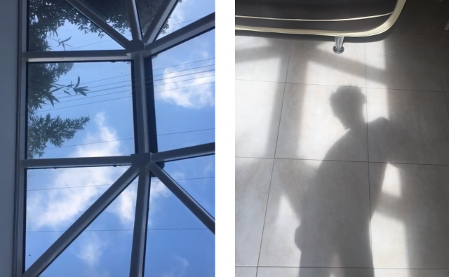

dear, dear friend –

maybe it is unreasonable to begin this letter with an apology, but regardless, i feel compelled. let me quickly say, i’m sorry for being a bit selfish with my writing lately; my last two letters were less of a conversation and far more a spilling over of my inner self. have you ever felt your heart on the verge of bursting, like a bud about to sprout through your ribcage – a swollen feeling, right _there_, square in your chest? this is where my body has been, though i like to think i’m growing better at managing it.

thank you, for bearing with me. & especially for the kind words sent in response to my last letter and the one before – it is such a blessing and joy, to be able to hold this space with you.

i feel life really moving now, at almost breakneck speed. do you too, in your corner of the world? a few nights ago, the clouds flew so quickly in the night sky; i was walking home from the overground station and looking up took my breath away. a precious moment that i just wanted to capture some essence of, to fold in your hand and really show you – when i couldn’t help but think about d. and feel a bit stupid, but also a bit grateful, and closer to the world.

anyway. trying to make sure i [moonlist](https://themoonlists.substack.com/about) every month this year; so, at the very least, you’ll hear from me again within that timescale. and if you can and want – tell me how you are, what you’ve been up to and how this new year has greeted you, because i always like to know ♥︎

_1\. nostalgia_ for the first few days in addis abeba, both my mother and father were there, in time for a massive holiday (_t’imk’et_, spelled as ጥምቀት, translated as baptism and celebrating [epiphany](http://en.wikipedia.org/wiki/timkat?c=34ebca37-bdf5-43c1-977c-a4799b77fb19)). and one night we sat outside with my father’s sister and her family, ten or so of us crowded around this small white table, as amharigna, and tigregna and oromigna music blasted from the speakers, celebrating life and culture with such vividness, the bar patreons yelling and dancing in absolute joy.

i wish i had the words to describe: in Ethiopia, how there exists this imprint of absolute home, faint and pained but remarkable. the embodied memory of creation story, the landscape where, maybe in a dimension beyond what we know, my spirit emerged from the mud – my life, breathed into being. i can see a line of inheritance from family, and all that is carried with in it – dad saying to me, _i don’t remember the last time i was back in the country for such a holiday but it brings to me all these memories of my childhood…you can’t help but flashback_. our gazes return, out towards the electrified crowd and couples leaning over bottles of st. giorgis beer, and he adds: _sometimes i think about my life, everywhere i’ve travelled and built something for myself, and how far it is from this place now – i wonder, was it worth it, to leave all this?_

_2\. adjust_ i’m in love and still not used to that, not used to a lack of control with respect to intensity, depth of feeling – and beyond this, the sheer indeterminacy and ambiguity of what’s unfolding, which unsettles in the deepest places. but…i’m working through it, an ongoing process of interrogation and dismantling how deeply i distrust myself, or rather my yearning, and the extent to which i was never allowed to take my desires seriously, or, equated them with weakness.

_3\. minor secrets_ losing myself more and more in daydreams; i felt like the only private moments i really had last month, amidst the constancy of travelling and presence of family or friends, were the brief moments in transit when i could just stare out of the window and let my mind wander through memory or emotion.

_4\. loss_ in a way, i feel that Ethiopia has been robbed from me for all my life – this past trip occupied a bittersweet place of reconnection yet realization of this loss, because there is a distance, still, between me and my family. the extent to which they know me, and i them, is so limited. and yes, there are aspects of my life and experience that i know will be impossible for many of my relatives to understand or accept, which brings sadness. but not total despair - i can see with more clarity what work might bring me into some semblance of restoration, connection, home.

_5\. time with a friend_ wow, so many beautiful times with friends this past month. (and realising, as i list it off in my mind, how all of these times actually involved food: lunch of abundance with salma and solange, thai with lauren & shantell, hot chocolate night hosted by olu, dinner with rajna & ilana at the magnificent pizza express…) – and every day i remain by the love and support that surrounds me, how generous and thoughtful and brilliant my friends are. (you included, of course ♥︎♥︎)

_6\. pare back_ since returning to london i’ve been keeping my room extremely clean. maybe this could be described as a simplification of space: throwing away a lot of random, unnecessary papers that i had mindlessly held onto, making sure i don’t fall into old habits of tossing dirty clothes on my desk chair or crowding the top of my dresser with books, scraps of writing, letters i don’t send to people – everything has a place now, a particular order, and it’s felt good to maintain it.

_7\. encounter_ i was on the bus returning from peckham, my backpack and two tote bags stuffed with produce from the street vendors and grocery store; a habesha woman boarded with her two children, one in a stroller and the other, perhaps five or six, boldly staring me down before settling in the seat beside me.  i listened and smiled quietly as the child asked his mother hilarious, innocuous questions in Amharic, cried at her for food – እናቴ፥ እናቴ፥ አራበኝ፥ ምግብ ስጭለኝ (_enate, enate, arabegn, migib sich’ilgn_) – and at one point he made such a ridiculous remark that his mother and i shared a glance, and couldn’t help but burst out laughing together.     

_8\. proportion_ every day that there is actual sun, my living room is lit so brilliantly around noon – the dancing shadows of trees, cast against our white walls – my body, illuminated alongside them – and the patches of sky that peer between the branches, how pure of a blue – i sit on my sofa and stare out into the garden, feeling blessed, feeling loved, feeling on the edge of something glorious and beyond time.

 

i hope i can hear from you soon. thinking of you, and sending my love always – 

--e

<a target="_blank" src="https://gardensongs.github.io">garden songs</a> by eden  
soggy streets, london, UK  

