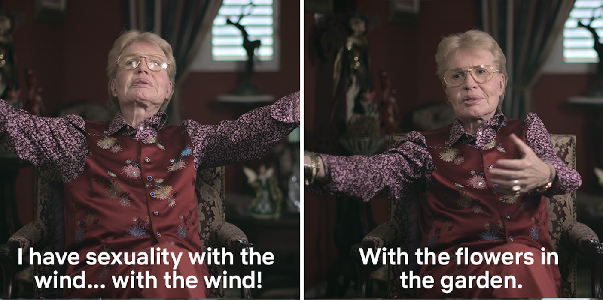

my street is often filled with noise but this is what i love about wintery days: how even sirens can be stilled, and sky swathed in its own grey blanket. in hibernation i tell myself tales of how the cold clarifies, how the sun strikes sharper. and try to imagine that what i feel as endings are, in reality, beginnings i cannot recognize — in the way that iron, through the pain of its own heat, might not observe its own form taking shape.

this is a lesson i thought i learned, but am always forced to re-encounter. and each re-telling, i know, comes with its own singular pain. we break, and our bodies struggle instinctively to new itself again.  it might be something innocuous — opening a can, slicing a bagel, what can only be explained as invisible creatures mischievously drawing knives up to your skin. it might be something relentlessly drawn out — being sick for over a month, waiting for rashes to crust over or nerves to be restored.  the rapid turn of weeks from one season to the next.  now i’m writing and spring is just about bursting from the seams.  historically i would say the transition from winter to spring has not been the best time in my life… or, i suppose, it’s a transition where i often return to the practice of finding ores of joy amidst near overwhelming sorrow — of stepping back into my own resilience and hope against all odds.  even though in the wonder of spring time, it seems as if the all the world so easily emerges back from its winter chill. days turn and trees blossom again, patches of grass regrow in tufts of hair, my bones crack from the new warmth, skin prickling and porous to everything.

sometimes i find a fantastical, self-absorbed nature to these changes too, in awe of the transformation.  i was sitting in greenpoint and watched as a white woman biked by with the air of a glowing parisian, fiery red hair billowing back behind her. she was sunglassed and mid-laugh as she rode past, and for some reason, looked directly at me behind her.  what did i see there? a compulsion not only to be beautiful, but to have others witness our beauty; to be miraculous in all the most delicious, most palatable ways.

but nothing about these days are remotely palatable, are they — they are impossibly cruel, irreconcilably sad. i feel myself surrounded by horrors too large to contain. all the while sitting in disappointment and betrayal, resentful of my own senses of longing. after swimming in different pools of personal grief for months, i thought that some work might be over; i felt like i was getting used to certain absences, successfully turning my attention elsewhere and rationalizing the lack.  but still there is this anger, though where can this anger be heard? i want to scream, demand, shouldn’t love just be enough?  i want to hope, but how?

somehow, i am here in this moment, writing to you. we are here together, in our difficult miraculous surviving. 

i’m trying to tell myself: to be in this place of offering, as much as i can, a loving presence amidst it all — is to every day make the decision: of whether to collapse time and lose myself in a hopeless spiraling of cycles…or to take the cycles themselves as a liberatory space of renewal. for renewal cannot happen without definitive ending. empires are built, and empires fall. hearts break and break and break, yet rebuild their musculature again — thanks to love and tenderness and humanity that transcends space and time. i want to be loved by myself, and the sun, and the wind and sky, or strangers i met fleetingly; i want to feel more deeply in my bones the love i know must exist from god to me -

 yes my sexuality & walter mercado’s are one and the same!! 

 

it’s cheesy, it’s tried and true; god knows how many poems have been written or songs sung!! but here i am, saying the same old things about change, about spring…

\--e

<a target="_blank" src="https://gardensongs.github.io">garden songs</a> by eden  
eastern pkwy, brooklyn, ny  

