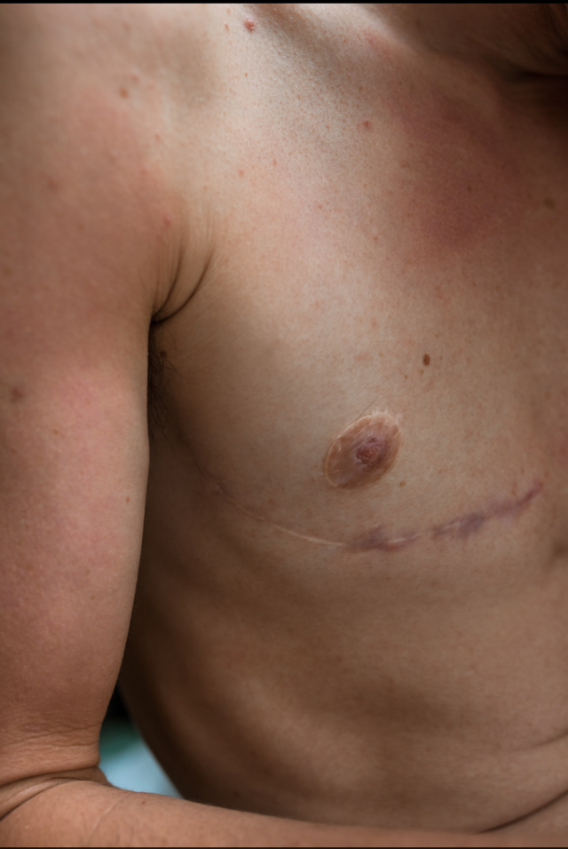
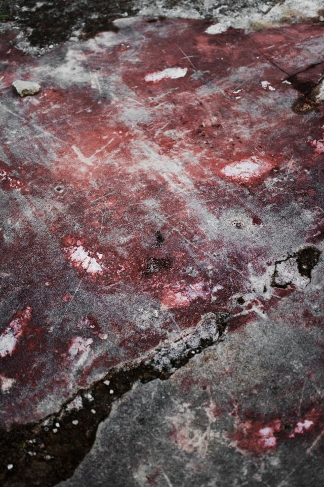
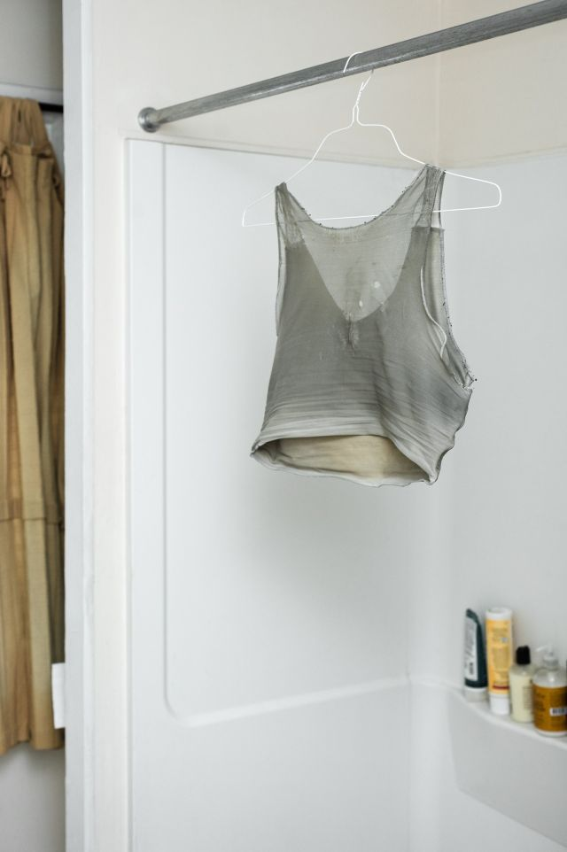
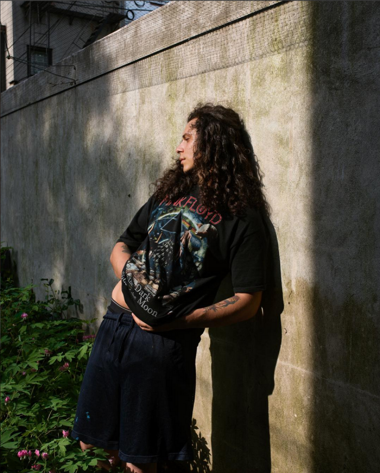

dear friends -

as the wonderful g. would salute: i hope the past few days have come to you gently, with brightness, and that you have found your desired frequencies with ease. <3

on monday, after a stupidly over-priced lunch of dumplings and bibimbap with j. in chelsea market, i met a. and z. at the moma ps1: a visit which is still very much on my mind.

the air here has quickly regained its sweltering heat from a brief spell of coolness, brought on by sudden rains;  desperate to wear the loosest clothes possible that day, i donned a daffodil-yellow dress and masked my increasingly unruly hair with a baseball cap stolen from my brother, as per-usual.  it's been difficult finding the right clothes for myself lately.  i am both hungry to bare my skin and frightened of doing so, because the way my frame attracts unwanted attention but demands (and deserves) space to breathe.

i had wanted to go to the museum after finding on their website the work of [elle pérez](http://www.instagram.com/elleperex/?c=34ebca37-bdf5-43c1-977c-a4799b77fb19), who's a visiting professor at harvard.  in retrospect i desperately wish we could have met, given the intersection of our circles; i modeled for a friend in pérez's introductory photography class, which also inspired the incredible collection of a.'s photographic work this summer. [_diablo_](http://www.moma.org/calendar/exhibitions/4996?c=34ebca37-bdf5-43c1-977c-a4799b77fb19) is the name of pérez's exhibition, represented by a single photo on the moma ps1 website: a nameless, sexless, genderless body reclining gently.  underneath the nipple that is set as a focal point, a sort of eye -- a thin trace of scar beneath, refusing to fade into skin.

 

many photographs in the exhibit reflected a lexicon from which i've learned to recognize [such scars](http://www.topsurgery.net/procedures/double-incision-top-surgery.htm?c=34ebca37-bdf5-43c1-977c-a4799b77fb19) for what they are: vestiges of battles constantly waged between the gender non-conforming and their inner / outer worlds. it was startling, to realize how time and thought has changed me and continue to do so as i build this queer vocabulary, and fashion a make-shift home from the liminal spaces my body often occupies.  on a chaotically organized cork-board that spanned one wall of the small exhibition room, pérez pinned a short passage of their writing: _Over time shape shifting has become a quick gesture, one that takes only a second or two to complete. It used to take longer, but the difference now is that its effects have become more evident...Over time i've learned to really look, finally seeing my reflection sideways or through a hazy mirror. When I was younger this made me angry, this not being able to see a direct reflection, and have it be perfectly legible. Now I'm just grateful for the traces that provide guidance and the space offered to me to be filled._

 

summer 2017, i lived in central square, cambridge -- which is slightly cooler than new york, but muggier, so you can't even tell the difference. and my home had no air conditioning, like every archaic building in the northeast. so my housemates and i would lounge about whenever we could, collapsing in front of a shitty box fan after fighting our way through the heat.  to my initial shock, l. and h. would often walk around the home nude from head to toe.  but i soon grew to cherish the ritual of immediately peeling off my clothes when i entered the front door; walking up a flight to the small kitchenette each morning for breakfast with l., who would stand cooking eggs or making coffee in full nakedness.  before that summer, i never imagined allowing my body such freedoms.  when you are someone for whom the relationship with the body is so fraught, life is considerably better when points of contention -- the breasts, the ass, the aspects that make woman-ness feel unbearably inextricable from public perceptions of my being -- are packed away.  i was beginning to consider top surgery and had just started the occasional bind, sweating through the constricting piece of fabric for the joy of a flattened chest.  it was the first time living in a home of folks with whom such emotions were more than accepted, but related to and openly discussed.  by august, i felt a new knowledge and love of my physical being in the present, beginning to co-exist with whatever inner desire for gender-queer transformation was developing a voice. from these friends i learned how physical intimacy, with others and the self, could make dysphoria a bit more understandable and forgivable. there is a quote from [a book by krista tippett](http://www.worldcat.org/title/becoming-wise/oclc/949750720-referer-brief_results?c=34ebca37-bdf5-43c1-977c-a4799b77fb19) that i was reading at the time, which i continue to come back to.  _Our bodies are longing and joy and fear and a lifelong desire to be loved, incarnate._ this feels so utterly true and important to honor, doesn't it?

 

i've been seeing z. for about a month now, which is bizarre and beautiful and i never know what to make of it. she and i are very different from each other, particularly when it comes to bodies and moving through the world. since the age of four, z. has trained as a dancer and is in the city finishing her final year at [the ailey school](http://www.theaileyschool.edu/?c=34ebca37-bdf5-43c1-977c-a4799b77fb19) (what have i continuously done since i was four? eating? sleeping?); and since the age of thirteen, she has been the target of men, who desire the symmetry of her face and the largeness of her eyes and the soft pinkness of her lips. i see how z. walks, or rather flows, with such innate grace and control. qualities i've often aspired to, but never acquired for myself. you could easily suppose she embodies a form of immaculate femininity that has haunted me throughout my life; but i am growing to see how even this exterior, which seems so put together and contrary to my own, possesses similarities, complexities, and imperfections underneath.every time she -- or anyone for that matter -- tells me i am beautiful, i receive it a skeptical gratitude.  it's been hard to look at myself from a view that does not emphasize what i feel is lacking or wrong -- i imagine many of us possess insecurities of this kind, making us wince slightly from our reflections. though in my heart of hearts, i know i do not lack anything; and whatever desires exist for physical changes are not synonymous with inadequacy, incompleteness. more so, they do not and will not keep me from being loved; this i have already learned throughout intimate relationships with friends, partners, those who were both or in-between (destroy the friend/lover divide!!)  i think this is why pérez's work held such deep resonance.  the photographs revealed this kind of love love so plainly -- which is not cheesy or idyllic, but a love that truly strips you naked, naked where you could really be _fucked,_ both literally and figuratively and not necessarily in a good way.  am i right in saying that, somehow, this is what we all desperately crave? to be in the open with all your cards on the table, giving up power and trusting, perhaps foolishly, that whoever is on the other side will give space and warmth to this vulnerability? if only because when they do, it is as if the whole world opens up to embrace you: as a product of courage, as unadulterated joy. sometimes, it seems to me like the only way one can both blissfully forget and find yourself.

 

it's been a jarring couple of months being out in the world, especially with the sudden scattering of the beloved community that has been a well of such love for me. and i am, as always, missing all who have been with me in the past few years of change. but i feel strangely comforted by the prospect of new beginnings; and lately i'm carrying [some words of arendt](http:mishkagora.wordpress.com/tag/hannah-arendt/?c=34ebca37-bdf5-43c1-977c-a4799b77fb19) with me, that every end necessarily contains a new beginning, which is the promise, the only message which the end can never produce -- our supreme capacity, guaranteed by each new birth.

stay cool, loved ones~   - e