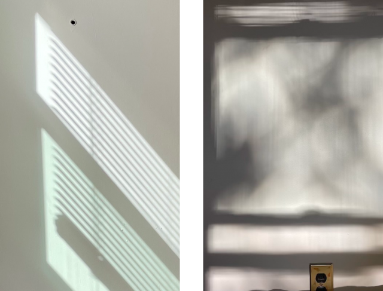
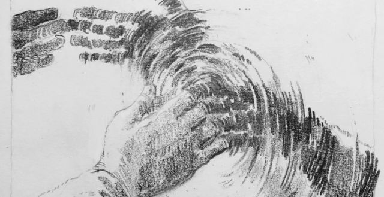

dear friend,

my memory has never been very good, but it’s the smaller things that i remember.  like that corner of lewisham on saint johns vale, the parent who stood as a silent shield while their child peed on the side of a wall.  or that evening alleyway in georgetown, a portal i peered through — one man, alone, crouched and smoking a cigarette in red light.  i was roaming the city with my mom; some fight, vague to me now, had made the air between us heavy. she was ahead, i happened to turn my head left. and these are such smaller things: the way i felt like that man, a little strange universe unto myself. the small ways i make things harder for myself than they should be. one morning in london i realized, while walking along a path towards a place to do a thing i’ve done time and time again, that i had crossed the street instinctively and irrationally. every time, reaching this street, i would cross it — only to cross back over. it made me wonder, when did this impulse establish itself? how did i let it happen, and why?

i tried to write you earlier — tried to write you for months — but couldn’t really bring myself to it. even this, right now, is mostly an attempt to pull something out of myself.  i feel it’s necessary, in the way free-association can sometimes be necessary. scraps, discarded on my computer, of letters started and stopped. i tried to write you once to say, actually, everything is glorious.  i tried to write you again, when on the edge of terrible. but in a strange way it’s all the same, this picture of what i’ve been living through and aiming for in general. which is slow slow moving, attempts at deep breaths, running on minimal fuel, poking at the boundaries of my surrounding world.

one night early last year, my housemate and i went on a long evening walk. we found ourselves in a forested area solely illuminated by the moon, eerie and spellbinding; we came upon a tree near the top of a hill, whose branches appeared to be spiralling towards the light. branches, twisting perfectly in a gnarled frame around this astonishing white orb. m. remarked that without the visual disruption of the lunar craters, the moon would look too pure to be true; as if the night sky was the perfect inversion of the day, a gaping white two-dimensional hole punching through a black sea. i thought about that necessary imperfection, as i sat in the light refracted – as i thought about you, how i would begin to write to you again.

 
***

 and then there are other markers. rosemary blooming, chicken bones littered on the sidewalk — which i recall not so much to set a scene for you but to cement what feels so fickle to my brain. last year they were transient visions that one day, i knew, i would suddenly stop living in. the year has passed, the living has changed. this year is marked by the most beautiful orange light, arriving every evening and transforming into oceanic blue. in my saddest moments i would lie in bed and notice how the rays sailed sharply through one window, softly through the next. the gingko tree across the street, casting a shadow that danced with such gentleness i thought, “maybe things will be okay.”

 

***

finally, the heat is breaking.  i’ve been home for almost two weeks now, dizzied from summer travel and just grateful to be still.  i’m taking the time to lie down on my side and re-enter my thoughts.  speaking in blunt language again, like: _my feet were dirty and i felt it an affront to myself, so i cleaned them_.  _i sat naked on the side of the tub and thought about jesus, washing the feet of his disciples_.  what comes easiest are observations, that which jolts me back into using all senses.

throughout this past school year, i couldn’t really believe where i was. there was a secret doubt, a prolonged holding a breath.  how could i be back here, amongst ivy again?  it felt like a dream, where i had but the haziest consciousness of my own self.  as if my body was a thin film, stretched along the surface of a pool.  not to say that i was unilaterally unhappy, or without agency —

but i guess what i’m still wrestling with is a directionless-ness, in spite of the obvious direction school places on a life. the nagging thought of something being off, or incomplete, or —

a missing sense of solidity, and by solidity i mean: something to ground in, something to say.

 

***

but i’m doing ok, friend, i’m doing ok. in a way i feel so beautiful and alive, as i’m more rooted in love than ever, and immensely grateful for those around me. i just miss you, terribly. i mourn what could have been and what time we could’ve spent together, had the past two years not been so violently isolating.  and i feel every day there is something new to mourn about the world, and the violence that is wreaked within and upon it.

still, somehow: one illumination of the past few days has been in the emergence of a small, sweet hope for what to come. it’s quiet, but it’s there. and i’m trying to nurture it where i can, move with its spirit.

thinking of you, and sending my love always, always ♥︎

\--e

<a target="_blank" src="https://gardensongs.github.io">garden songs</a> by eden  
for now, ptown, USA  

