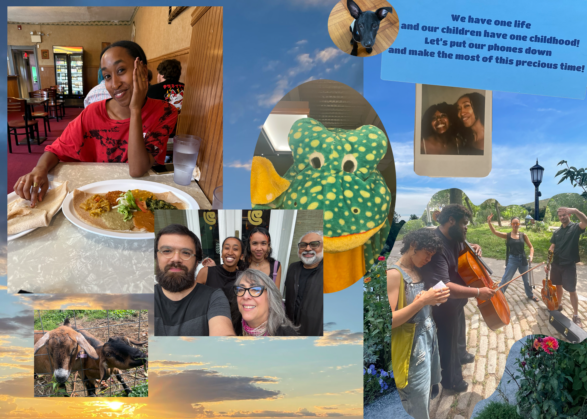

dear friend,

there was a day i awoke with angst burning a hole in my heart, and i thought to myself, maybe writing (finally) can re-direct the energy elsewhere.

summer still clings to the edges of the air, the smell of paint lightly hovering in my room.

in a little glass case, exhibiting what fleeting moments making up life: a lip balm they told me about, my wallet old and frayed, the pages of a planner i had abandoned for most of august, letting the days wash over.

and in the permanent collection: my upright piano with the soft pedal down, the scattered morning light through our northern windows, notes of love you wrote around my birthday.

i've been thinking of the past five years — unfolding amidst a looming backdrop of chapters now on their way to closing, too. i've thought about what it would do to erase certain parts of it: if i hadn't gone to school in the first place, if we never dated, if i never moved. part of me hungers for such erasure, even though i know i would fundamentally change.

what would i dream of, then? where would it be, the underbelly that stores all the tenderness? what side of the body would be more tense?

what would have become of those flowers, dried and packed gingerly into a little black box, carried from princeton to new york? a gift remembered now only for their sweet shade of blue.

blue is the sky, green is in the park, by the boathouse, speckled brown is the lake water, an otherworldly still, coated by a blanket of algae.

and my life feels very still. it is contained in daily rituals that keep my heart steady. waking into day, chipping away at work, cooking tofu the way lesley taught me, calling maeve on tuesdays. it's a relief to have things simple, for once — even as remains of heartbreaks linger quietly in the corner. i think we have finally grown to embrace each other.

when i write you here, somehow it is the most presentational and the most honest i manage being. crouching down and organizing souvenirs of thought, just to cradle them, and say to you, <em>look...!</em> 

time has been moving so quickly that it's been hard to write even to myself anymore. but thank you for always giving me more chances to try ☀︎

 and some more souvenirs for you! a collage of photos from summer :P 

love, 
e

<a target="_blank" src="https://gardensongs.github.io">garden songs</a> by eden  
eastern pkwy, brooklyn, ny  

